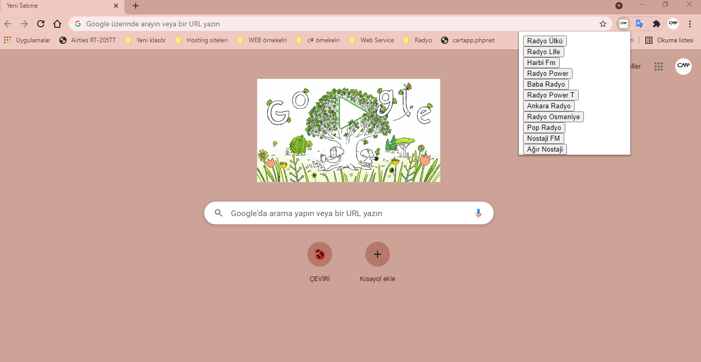

# Radio-Plugin
We created a plugin using the Google radio api.
#
- HTML page
- Simple code
- It provides voice.
- Music player
- API support
- Simple to Use
#
</img>
## Important!!!
Type "chrome: // extensions /" in the search bar and open the page where the extensions are installed.
Enable the "Developer Mode" option in the upper right corner.
Click the "Upload Unpackaged" button, select your extension folder and install.
The music stops when the screen goes out.
#
## Codpen.io
[Codpen account link](https://codepen.io/oguzhan1881)
## Github Account Link
[Github account link](https://github.com/oguzhan18)
## Mail
oguzhancart1@gmail.com
# Instagram Account Link

